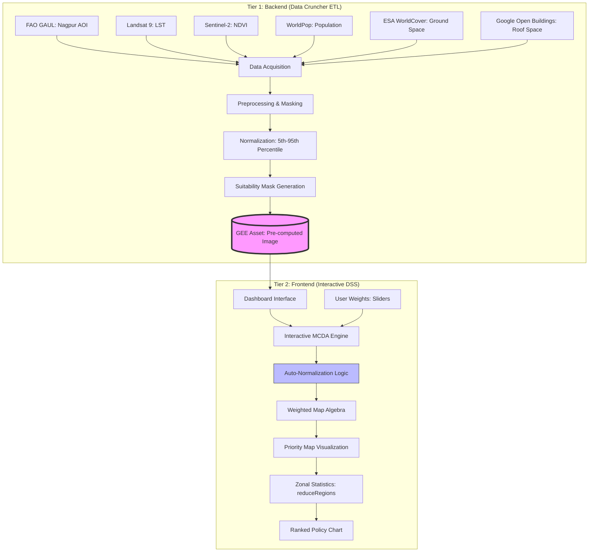

# 🌳 Strategic Afforestation DSS

An interactive Decision Support System (DSS) built on Google Earth Engine (GEE) to combat urban heat islands and rural heat exposure in the Nagpur District. 

By fusing high-resolution satellite imagery with population density data, this tool allows urban planners to dynamically rank and prioritize sub-districts (Tehsils) for budget allocation and tree-planting initiatives.

## ✨ Key Features
* **Multi-Criteria Decision Analysis (MCDA):** Planners can use interactive sliders to assign custom weights to 3 critical factors: Heat Island Intensity, Lack of Greenery, and Population Density.
* **Intelligent Space Masking:** The algorithm automatically identifies viable planting zones by isolating bare ground, grass, shrubs, and rooftop spaces, ignoring water bodies and existing dense forests.
* **Interactive Policy Dashboard:** Generates a real-time, clickable bar chart that calculates the exact target afforestation area in **Square Kilometers** per Tehsil. Clicking a bar instantly swoops the map to highlight that specific region.
* **Pre-Computed ETL Pipeline:** Separated backend data processing from the frontend UI to ensure lightning-fast dashboard performance.

## 🛠️ Tech Stack & Datasets
* **Platform:** Google Earth Engine (JavaScript API)
* **Thermal Data:** Landsat 9 (LST - Land Surface Temperature)
* **Vegetation Data:** Sentinel-2 Harmonized (NDVI)
* **Population Data:** WorldPop (100m resolution)
* **Land Cover / Structures:** ESA WorldCover 2021 & Google Open Buildings v3
* **Administrative Boundaries:** Datameet Indian Shapefiles (Maharashtra Sub-Districts)

## 📂 Project Structure

The project is split into two primary Google Earth Engine scripts to optimize performance:

### ` THE DATA CRUNCHER.js` (The ETL Pipeline)
A heavy-duty processing script that defines the Area of Interest (AOI), acquires satellite imagery for the Summer 2025 temporal window, and normalizes the criteria into 0-to-1 scores. It generates a comprehensive suitability mask and exports the massively computed 4-band image as a dedicated GEE Asset.

### ` THE INTERACTIVE DSS.js` (The Dashboard)
The frontend user interface. It loads the pre-computed asset from Script 1 and the administrative shapefiles. It constructs the split-screen UI, powers the interactive MCDA slider math, applies the custom weights, and renders the clickable District Budget Priority chart.

## 🚀 How to Run

1. Open the [Google Earth Engine Code Editor](https://code.earthengine.google.com/).
2. **Upload Shapefile:** Upload a zipped shapefile of the Maharashtra Sub-Districts to your GEE Assets.
3. **Run Script 1:** Paste the code from `THE DATA CRUNCHER.js`. Run it, go to the "Tasks" tab, and execute the export. Wait for the asset to generate.
4. **Update Asset Paths:** Open `THE INTERACTIVE DSS.js` and update Lines 9 and 12 with your specific GEE Asset IDs for the exported data and the uploaded shapefile.
5. **Run Script 2:** Hit Run. Use the sliders in the bottom right to calculate the priority map, and click on the generated bar chart to explore the Tehsils!

## 💡 Key Data Insight
During testing for the Vidarbha summer, the data revealed a critical "Rural Heat Exposure" spike. While urban centers are assumed to be the primary targets for afforestation, the DSS proves that massive, exposed rural tehsils (like Katol and Hingna) contain significantly larger absolute areas of critical heat risk. This tool helps District Collectors allocate saplings proportionally to mitigate regional heatwaves, not just city-center temperatures.

